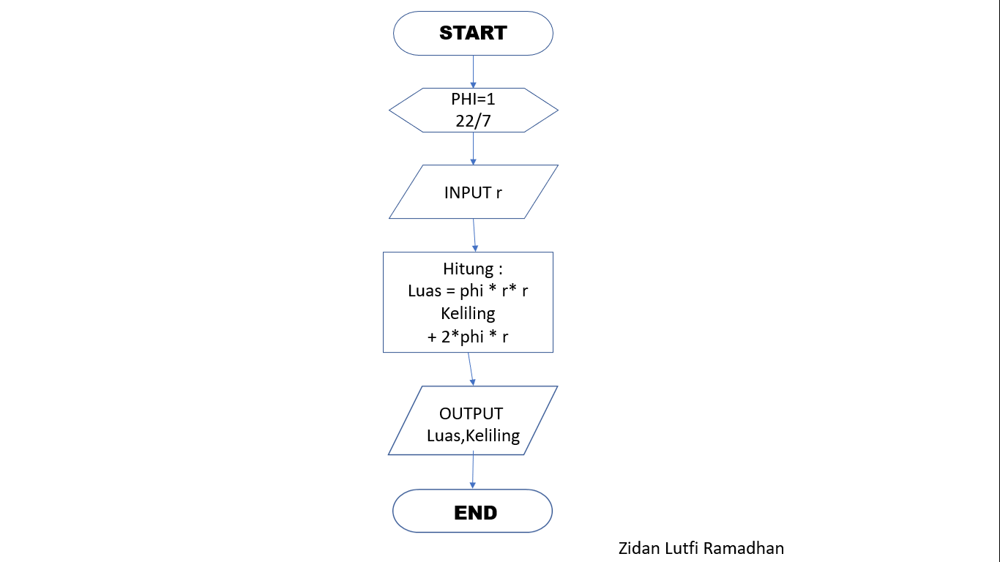
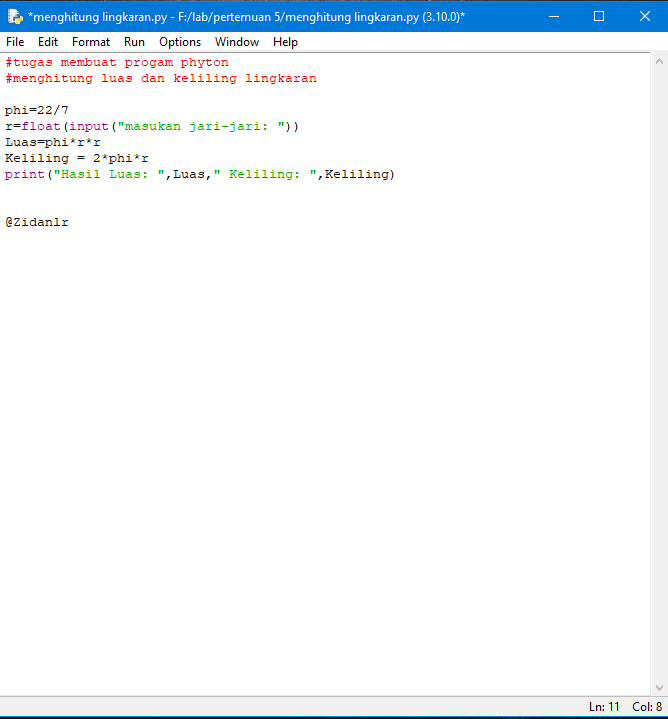
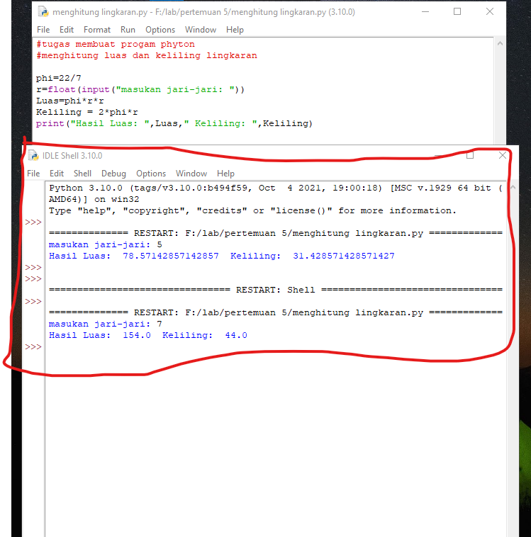

# Tugas membuat coding phyton
## menghitung luas dan keliling lingkaran
### gambar dibawah adalah flowchart yang digunakan untuk membuat coding ini

dan selanjutny adalah membuat coding seperti berikut

sehingga akan menghasilkan program sebagai berikut

diatas adalah cara membuat program menggunakan phython

#### zidan lutfi ramadhan_312110304